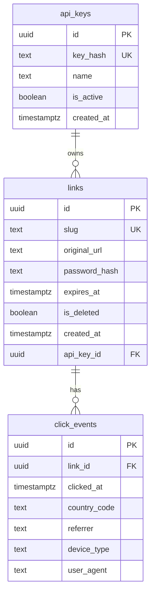

# Entity Relationship Diagram

```mermaid
erDiagram
    links {
        uuid        id          PK
        text        slug        UK
        text        original_url
        text        password_hash
        timestamptz expires_at
        boolean     is_deleted
        timestamptz created_at
        uuid        api_key_id  FK
    }

    click_events {
        uuid        id          PK
        uuid        link_id     FK
        timestamptz clicked_at
        text        country_code
        text        referrer
        text        device_type
        text        user_agent
    }

    api_keys {
        uuid        id          PK
        text        key_hash    UK
        text        name
        boolean     is_active
        timestamptz created_at
    }

    links ||--o{ click_events : "has"
    api_keys ||--o{ links : "owns"
```